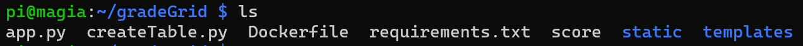
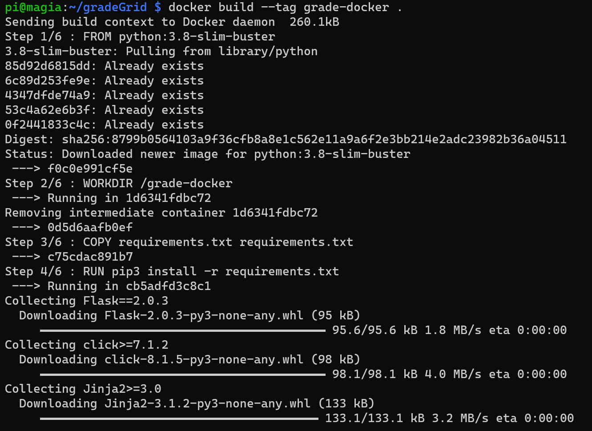
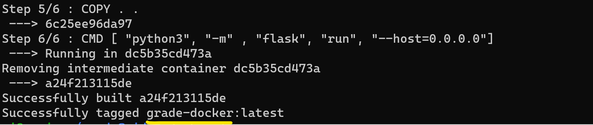
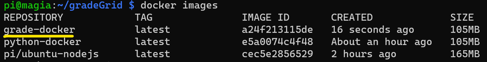
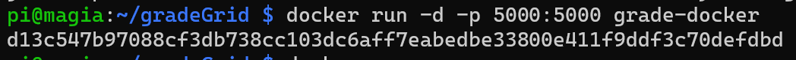
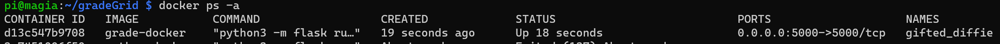
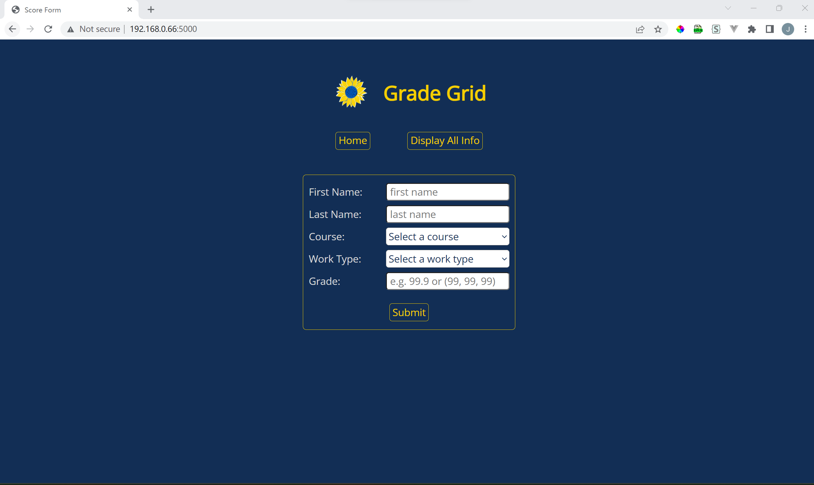

## Make a Docker image and run it as a container

##### 1. Application directory structure




##### 2. Build a Docker image

run the command below:

```
docker build --tag grade-docker .
```

part of the output:






##### 3. Run an image as a container

###### i. Check available images by running:

```
docker images
```

Output:




###### ii. Run the image by executing command below

```
docker run -d -p 5000:5000 grade-docker
```

Output:




###### iii. Check running containers

```
docker ps -a
```

Output:




###### iv. On the laptop, connect to `http://<pi-ip-address>:5000`

